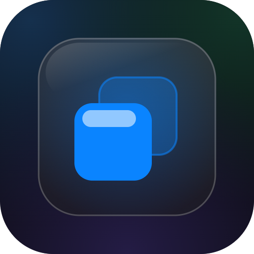

<p align="center">
  
</p>

# liquid-glass-kit — Apple 液態玻璃 React 材質庫

[English](#english) | [繁體中文](#繁體中文)

---

## English

Apple Liquid Glass UI materials for React — a refractive `<LiquidGlass>` component built
on [jh3y's SVG displacement technique](https://codepen.io/jh3y/pen/EajLxJV), plus
frosted-glass CSS materials for everything else.

### Install

```bash
npm i github:lp250isme/liquid-glass-kit
```

### Usage

```jsx
// main.jsx — once
import 'liquid-glass-kit/styles.css';
```

```jsx
import { LiquidGlass } from 'liquid-glass-kit';

// Floating dock
<LiquidGlass radius="full" frost={0.06} className="px-2 py-1.5">{tabs}</LiquidGlass>

// Card
<LiquidGlass radius={28} frost={0.1} className="p-6">{content}</LiquidGlass>
```

```jsx
// Small / repeated elements: use CSS materials, NOT <LiquidGlass>
<div className="glass rounded-full">{floatingButton}</div>     // base glass (incl. press state)
<div className="glass-media rounded-full">{onDarkStage}</div>  // for dark stages / over images
<div className="glass-panel rounded-2xl">{tabBar}</div>        // primary surface (full Jhey shadow stack)
<div className="glass-sheet rounded-t-xl">{bottomSheet}</div>  // bottom panel (readability first)
<div className="glass-chip rounded-2xl p-4">{listItem}</div>   // list items / small controls
```

```jsx
// Interactive controls (needs framer-motion >= 11)
import { Segmented, Stepper, Slider, LiquidSliderDefs, GlassButton, Chip } from 'liquid-glass-kit/motion';

<LiquidSliderDefs />   {/* Slider's SVG filter — mount once at app root */}
<Segmented options={[{value:'a',label:'A'},{value:'b',label:'B'}]} value={v} onChange={setV} />
<Slider value={x} min={0} max={100} onChange={setX} />   {/* jh3y liquid capsule slider */}
<Stepper onDecrement={dec} onIncrement={inc} />
<GlassButton onClick={fn}>{icon}</GlassButton>
<Chip active={on} onClick={toggle}>Label</Chip>
```

### `<LiquidGlass>` props

| prop | default | meaning |
|---|---|---|
| `as` | `'div'` | element to render |
| `radius` | `24` | corner px, or `'full'` (capsule) |
| `frost` | `0.08` | frosted base-tint opacity |
| `saturation` | `1.4` | backdrop saturation |
| `brightness` | `1.05` | backdrop brightness |
| `scale` | `-110` | displacement strength (negative = refract inward) |
| `displace` | `0.4` | output blur (softens refracted edge) |
| `border` | `0.07` | refracted-edge thickness ratio |
| `chromatic` | `{r:0,g:6,b:12}` | per-channel RGB displacement (dispersion strength) |
| `tracking` | `false` | specular highlight follows the cursor (hover devices only; tune via `--lg-sheen`) |
| `elastic` | `false` | liquid recoil: glass nudges toward the cursor, springs back on leave. `true` = 0.14, or pass 0–1; disabled under `prefers-reduced-motion`. Uses independent `translate`/`scale` props so it won't clobber your app's `transform` positioning |

### Theming (design tokens)

All materials and controls read `--lg-*` design tokens; the kit ships iOS-style light/dark
defaults. Dark is activated by an ancestor `.dark` class (Tailwind convention) or
`[data-theme="dark"]`; redeclare the tokens in your own CSS to retheme (your declarations
always win over the kit defaults, including `prefers-color-scheme` auto scenarios).

| Token | Purpose |
|---|---|
| `--lg-frost` / `--lg-frost-strong` | glass base tint (normal / primary surface) |
| `--lg-edge` / `--lg-glow` / `--lg-shadow` | edge highlight / inner glow / drop shadow |
| `--lg-press` | pressed-state tint |
| `--lg-sheet-bg` / `--lg-chip-bg` | sheet / chip background overrides |
| `--lg-label` / `--lg-label2` / `--lg-separator` / `--lg-bg` | control text / structure colors |
| `--lg-tint` | brand color (slider fill, focus ring) |
| `--lg-segment` / `--lg-track` / `--lg-knob` / `--lg-liquid-gray` | control-specific |

`<LiquidGlass>`'s `frost` prop uses its own `--lg-host-frost` (inlined per instance), so it
doesn't clash with the table above.

### ⚠️ Limits (important)

1. **Refraction only works on Chromium.** `backdrop-filter: url()` is unsupported on
   Safari/Firefox/iOS (incl. iOS Chrome — it's WebKit); the component auto-falls back to
   frosted blur — still good-looking, just no edge refraction. No action needed.
2. **Each `<LiquidGlass>` instance carries one SVG filter + a ResizeObserver.** Use it on
   primary surfaces (dock, inputs, cards, modal); for list items / buttons use
   `.glass-chip` / `.glass-sheet` (zero filter cost).
3. **While an ancestor animates `opacity`** (e.g. framer-motion enter/exit), the backdrop
   sampling shifts temporarily and snaps back when the animation ends. Sub-0.2s enters are
   imperceptible.
4. Displacement map regenerates on resize (the caveat jh3y calls out — handled internally).
5. The glass needs *something* behind it to refract/blur — invisible on flat white; pairs
   best with a mesh-gradient background.

### Recipes

`recipes/icon-source.html` — an SVG template for liquid-glass app icons (light/dark),
rendered to PNG via headless Chrome:

```bash
"/Applications/Google Chrome.app/Contents/MacOS/Google Chrome" \
  --headless=new --screenshot=/tmp/icons.png \
  --window-size=1024,512 --force-device-scale-factor=2 \
  --default-background-color=00000000 --hide-scrollbars \
  "file://$(pwd)/recipes/icon-source.html"
magick /tmp/icons.png -crop 1024x1024+0+0    +repage -resize 512x512 -strip icon.png
magick /tmp/icons.png -crop 1024x1024+1024+0 +repage -resize 512x512 -strip icon-dark.png
```

### Next.js

- Ships a `'use client'` banner and SSR-safe effects — import directly in the App Router.
- TypeScript types included (`index.d.ts` / `motion.d.ts`).

### Cross-promo

The "more by kv" card was split into its own package →
[more-by-kv](https://github.com/lp250isme/more-by-kv) (removed from the kit since v0.4.0).

### Credits

- Core refraction: [Jhey Tompkins (@jh3y)](https://codepen.io/jh3y) — ["liquid glass"](https://codepen.io/jh3y/pen/EajLxJV) (MIT)
- Liquid slider: jh3y — ["cross browser liquid slider"](https://codepen.io/jh3y/pen/qEbYRVg) (MIT)

### License

MIT

---

## 繁體中文

給 React 用的 Apple 液態玻璃 UI 材質——一個折射式 `<LiquidGlass>` 元件（基於
[jh3y 的 SVG 位移技法](https://codepen.io/jh3y/pen/EajLxJV)），外加給其他場合用的霜面玻璃
CSS 材質。

### 安裝

```bash
npm i github:lp250isme/liquid-glass-kit
```

### 用法

```jsx
// main.jsx — 一次
import 'liquid-glass-kit/styles.css';
```

```jsx
import { LiquidGlass } from 'liquid-glass-kit';

// 浮動 dock
<LiquidGlass radius="full" frost={0.06} className="px-2 py-1.5">{tabs}</LiquidGlass>

// 卡片
<LiquidGlass radius={28} frost={0.1} className="p-6">{content}</LiquidGlass>
```

```jsx
// 小型／重複元素：用 CSS 材質，不要用 <LiquidGlass>
<div className="glass rounded-full">{floatingButton}</div>     // 基本玻璃（含 press 態）
<div className="glass-media rounded-full">{onDarkStage}</div>  // 深色舞台／圖片上專用
<div className="glass-panel rounded-2xl">{tabBar}</div>        // 主表面（完整 Jhey 陰影棧）
<div className="glass-sheet rounded-t-xl">{bottomSheet}</div>  // 底部面板（易讀優先）
<div className="glass-chip rounded-2xl p-4">{listItem}</div>   // 列表項／小控件
```

```jsx
// 互動控件（需要 framer-motion >= 11）
import { Segmented, Stepper, Slider, LiquidSliderDefs, GlassButton, Chip } from 'liquid-glass-kit/motion';

<LiquidSliderDefs />   {/* Slider 的 SVG 濾鏡，app root 掛一次 */}
<Segmented options={[{value:'a',label:'A'},{value:'b',label:'B'}]} value={v} onChange={setV} />
<Slider value={x} min={0} max={100} onChange={setX} />   {/* jh3y 液態膠囊滑塊 */}
<Stepper onDecrement={dec} onIncrement={inc} />
<GlassButton onClick={fn}>{icon}</GlassButton>
<Chip active={on} onClick={toggle}>標籤</Chip>
```

### `<LiquidGlass>` props

| prop | 預設 | 說明 |
|---|---|---|
| `as` | `'div'` | 渲染的元素 |
| `radius` | `24` | 圓角 px，或 `'full'`（膠囊形） |
| `frost` | `0.08` | 霧面底色不透明度 |
| `saturation` | `1.4` | backdrop 飽和度 |
| `brightness` | `1.05` | backdrop 亮度 |
| `scale` | `-110` | 位移強度（負值向內折射） |
| `displace` | `0.4` | 輸出模糊（柔化折射邊緣） |
| `border` | `0.07` | 折射邊緣厚度比例 |
| `chromatic` | `{r:0,g:6,b:12}` | RGB 各通道位移差（色散強度） |
| `tracking` | `false` | specular 高光跟著游標走（僅 hover 裝置；亮度可用 `--lg-sheen` 調） |
| `elastic` | `false` | 液態回彈：玻璃朝游標微位移、離開時 spring 回彈。`true`＝0.14，或傳 0–1；`prefers-reduced-motion` 自動停用。用獨立的 `translate`/`scale` 屬性實作，不會打掉 app 的 `transform` 定位 |

### 主題（design tokens）

所有材質和控件吃 `--lg-*` design token，kit 內建 iOS 風格的淺/深預設值。深色由祖先 `.dark`
class（Tailwind 慣例）或 `[data-theme="dark"]` 啟動；app 在自己的 CSS 重新宣告 token 即可換
主題（app 的宣告永遠蓋過 kit 預設，含 `prefers-color-scheme` auto 模式）。

| Token | 用途 |
|---|---|
| `--lg-frost` / `--lg-frost-strong` | 玻璃底色（一般 / 主表面） |
| `--lg-edge` / `--lg-glow` / `--lg-shadow` | 邊緣高光 / 內光暈 / 投影 |
| `--lg-press` | 按下狀態底色 |
| `--lg-sheet-bg` / `--lg-chip-bg` | sheet / chip 底色覆寫 |
| `--lg-label` / `--lg-label2` / `--lg-separator` / `--lg-bg` | 控件文字／結構色 |
| `--lg-tint` | 品牌色（slider fill、focus ring） |
| `--lg-segment` / `--lg-track` / `--lg-knob` / `--lg-liquid-gray` | 控件專用 |

`<LiquidGlass>` 的 frost prop 走獨立的 `--lg-host-frost`（元件內聯），不與上表衝突。

### ⚠️ 使用邊界（重要）

1. **折射只在 Chromium 生效**。`backdrop-filter: url()` Safari/Firefox/iOS（含 iOS Chrome，
   它是 WebKit）不支援，元件會自動退回 frosted blur——一樣好看，只是沒有邊緣折射，不需要你做任何事。
2. **每個 `<LiquidGlass>` 實例帶一個 SVG 濾鏡 + ResizeObserver**。用在主要表面（dock、輸入框、
   卡片、modal）；列表項、按鈕等重複元素請用 `.glass-chip` / `.glass-sheet`，零濾鏡成本。
3. **祖先在動畫 `opacity` 期間**（如 framer-motion 進出場），backdrop 取樣範圍會暫時改變，動畫
   結束就恢復正常；0.2s 級別的進場肉眼幾乎無感。
4. 位移貼圖在元素 resize 時自動重新生成（jh3y 點名的 caveat，元件內建處理）。
5. 玻璃效果需要背景有「東西」可折射/模糊——純白背景上看不出效果，搭配 mesh gradient 背景最佳。

### Recipes

`recipes/icon-source.html` — 液態玻璃風格 app icon 的 SVG 模板（深淺兩版），用 headless Chrome
渲染成 PNG（指令同上方英文段）。

### Next.js

- 已內建 `'use client'` banner 與 SSR-safe effect，App Router 直接 import 即用。
- TypeScript 型別已附（`index.d.ts` / `motion.d.ts`）。

### Cross-promo

「kv 的其他作品」卡片已抽成獨立庫 →
[more-by-kv](https://github.com/lp250isme/more-by-kv)（v0.4.0 起自 kit 移除）。

### 致謝

- 核心折射技術：[Jhey Tompkins (@jh3y)](https://codepen.io/jh3y) — ["liquid glass"](https://codepen.io/jh3y/pen/EajLxJV)（MIT）
- 液態滑塊：jh3y — ["cross browser liquid slider"](https://codepen.io/jh3y/pen/qEbYRVg)（MIT）

### License

MIT
